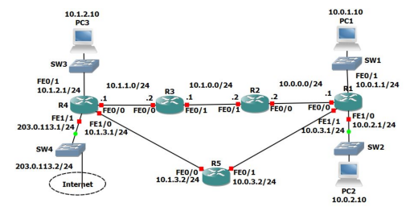
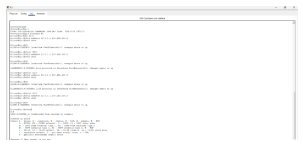
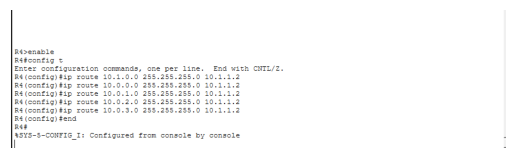
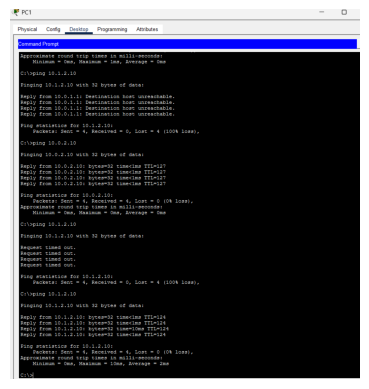
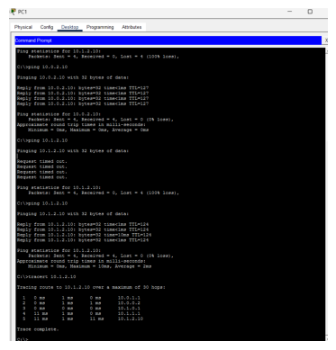
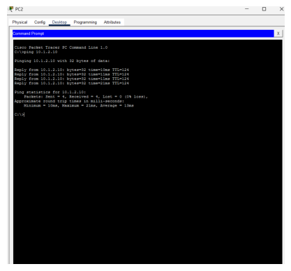

## Overview
This project demonstrates manual static routing across a five-router topology built in Cisco Packet Tracer.
The goal was to achieve full end-to-end connectivity between multiple LAN segments using only static routes.

---

## Topology

The lab includes:
- 5 routers (R1–R5)
- Multiple /24 LAN segments
- Transit networks between routers
- A documentation "Internet" network (203.0.113.0/24)

---

## What This Lab Demonstrates

- Interface configuration and subnetting
- Static route configuration
- Default routing
- Path verification with traceroute
- End-to-end connectivity validation

---

## Key Configuration Example (R1)

ip route 10.1.0.0 255.255.255.0 10.0.0.2
ip route 10.1.1.0 255.255.255.0 10.0.0.2
ip route 10.1.2.0 255.255.255.0 10.0.0.2
ip route 10.1.3.0 255.255.255.0 10.0.0.2

# Screenshots

