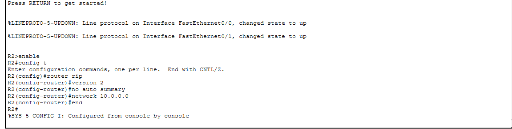
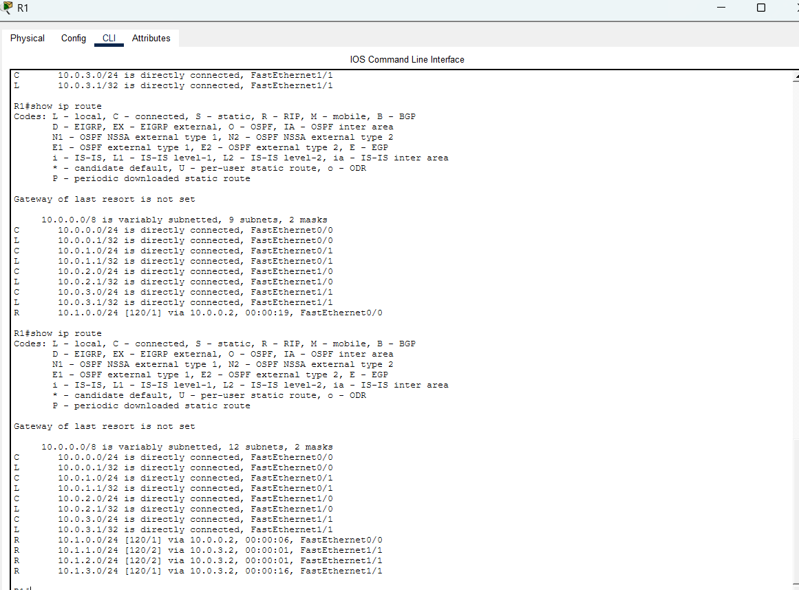
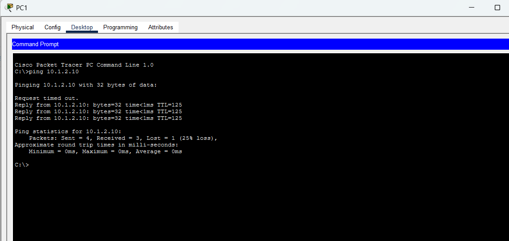
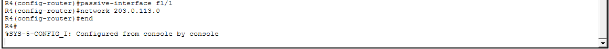
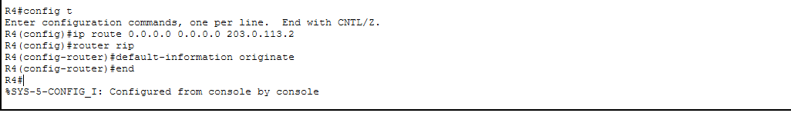
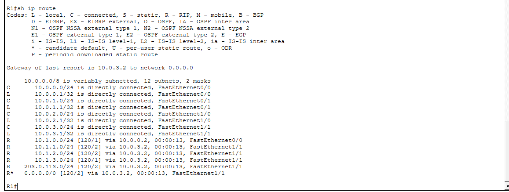

# RIP Routing Lab

This lab demonstrates using **RIP (Routing Information Protocol)** in Cisco Packet Tracer to allow multiple routers to share routing information automatically.

The screenshots show RIP being configured on the routers so they can advertise their networks to each other. Once RIP is enabled and the networks are advertised, each router learns routes to remote networks dynamically.

After the configuration, the routing tables were checked using `show ip route` to confirm that the routers successfully learned routes through RIP.

Finally, connectivity was tested from a PC using `ping`. The successful replies confirm that routing between the networks is working and that RIP is correctly exchanging routing information between the routers.

## Screenshots

