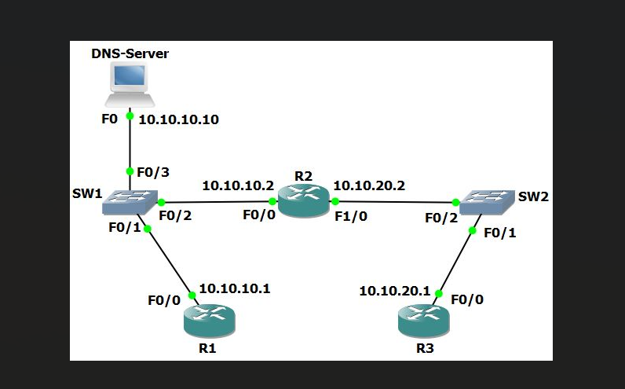
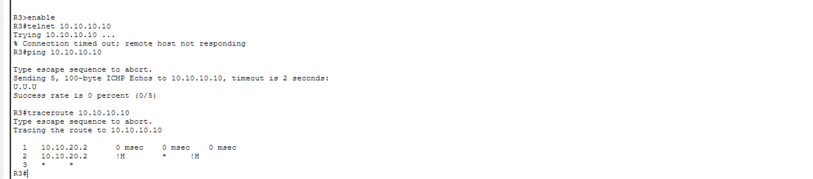
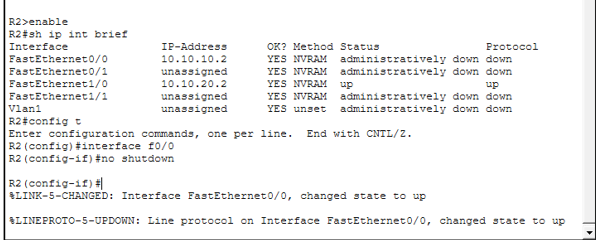
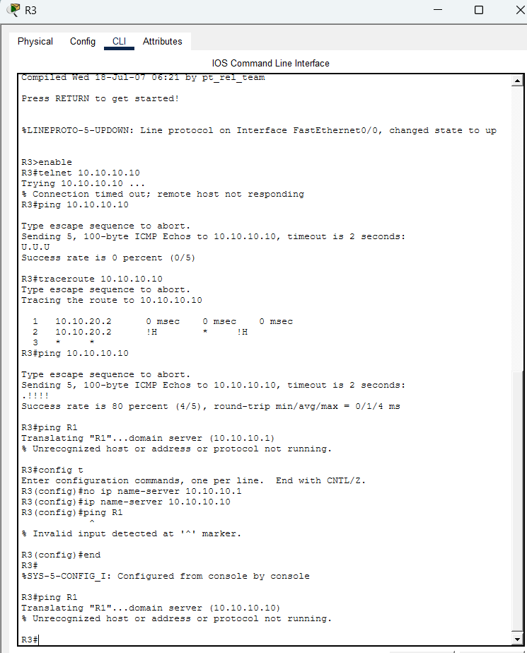
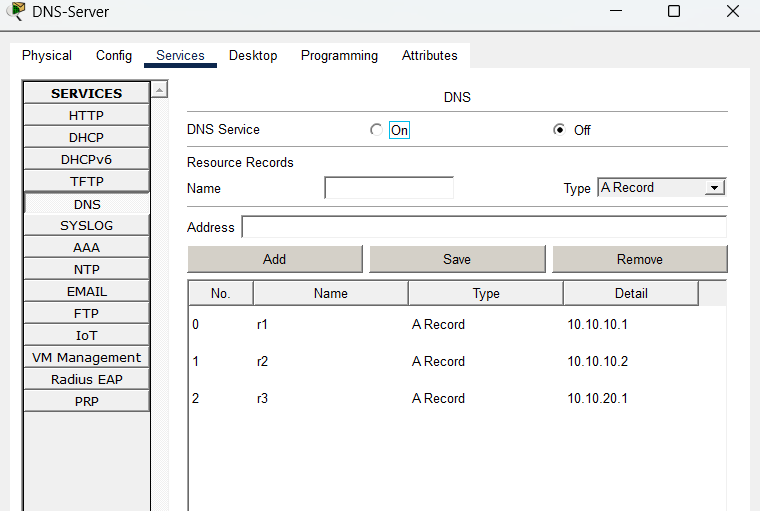
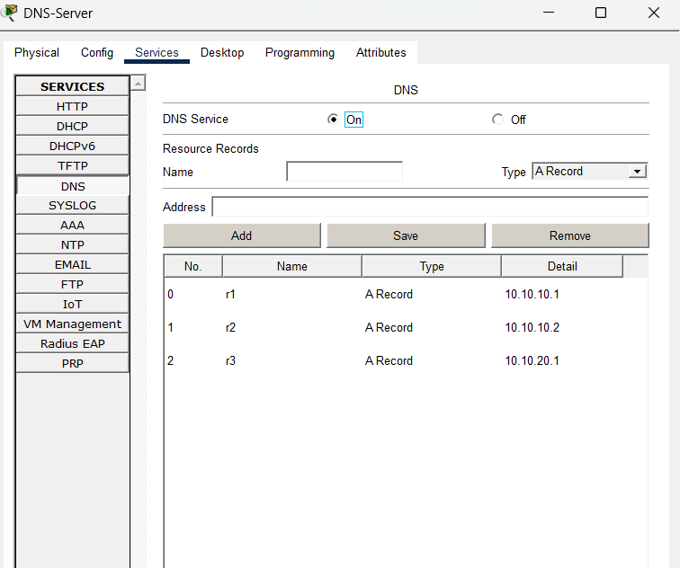
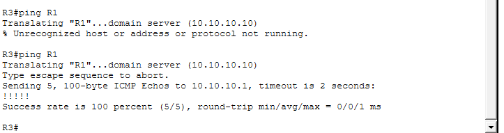

# Packet Tracer Lab – Troubleshooting a Down DNS Server

## Overview

This lab demonstrates troubleshooting a DNS name resolution failure in a routed Cisco network.

The issue:
- Routers could not resolve hostnames
- DNS server appeared unreachable
- Ping and Telnet attempts failed
- Traceroute stopped at R2

This project documents the step-by-step troubleshooting process and resolution.

Devices:
- R1
- R2
- R3
- DNS Server (10.10.10.10)
- SW1 / SW2

Networks:
- 10.10.10.0/24
- 10.10.20.0/24

# 🔎 Problem Symptoms

### 1️⃣ R3 Could Not Reach DNS Server

# 🧠 Root Causes Identified
1. R2 interface toward DNS network was administratively down
2. DNS service was disabled on the DNS server
3. Router DNS client configuration was missing

## Screenshots

